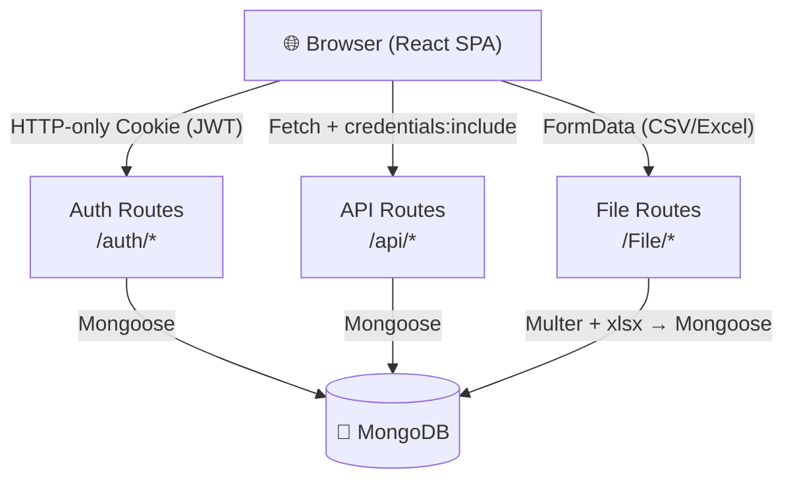
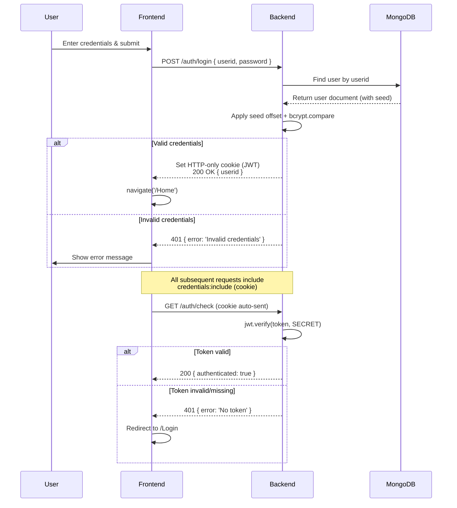
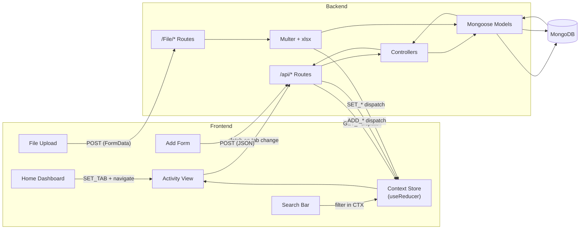
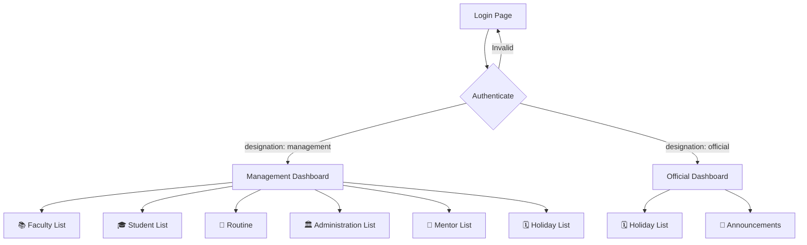

<h1 align="center">
  <br/>
  🎓 Kampus Life Portal
  <br/>
</h1>

<p align="center">
  <b>A full-stack campus management web application — built with React, Node.js, Express & MongoDB.</b>
</p>

<p align="center">
  
  
  
  
  
</p>

<p align="center">
  <a href="https://twitter.com/aritra_2005" target="_blank">
    
  </a>
</p>

---

## 📖 Table of Contents

- [Overview](#-overview)
- [Features](#-features)
- [Tech Stack](#-tech-stack)
- [Architecture](#-architecture)
- [Project Structure](#-project-structure)
- [Authentication Flow](#-authentication-flow)
- [Data Flow](#-data-flow)
- [API Reference](#-api-reference)
- [Role-Based Access](#-role-based-access)
- [File Upload Format](#-file-upload-format)
- [Getting Started](#-getting-started)
- [Environment Variables](#-environment-variables)
- [Author](#-author)

---

## 🌟 Overview

**Kampus Life Portal** is a role-aware campus management system designed to centralize and streamline academic administration. It provides two user roles — **management** and **official** — each with a tailored dashboard to manage faculty, students, routines, administration lists, mentors, holidays, and announcements.

The backend is a RESTful Express API connected to MongoDB. The frontend is a React SPA with glassmorphism UI, protected routing, and a Context API-powered state layer.

---

## ✨ Features

| Feature | Description |
|---|---|
| 🔐 JWT Authentication | HTTP-only cookies with seeded bcrypt password hashing |
| 👥 Role-Based Access | `management` and `official` designations with different dashboards |
| 📋 CRUD Operations | Create, read, and delete records for all data entities |
| 📤 Bulk File Import | Upload CSV or Excel files to populate any data collection |
| 📢 Announcements | Auto-expiring announcements with configurable TTL |
| 🔒 Protected Routes | Frontend routes guarded by auth cookie verification |
| 🔍 Search | Per-entity search on the activity view |
| 🎨 Glassmorphism UI | Frosted glass panels with animated background |

---

## 🛠 Tech Stack

### Frontend
- **React 19** with functional components and hooks
- **React Router DOM 7** for client-side routing
- **Context API + useReducer** for global state management
- **CSS** with custom glassmorphism styling

### Backend
- **Node.js + Express 5** REST API
- **MongoDB + Mongoose 8** for data persistence
- **JSON Web Tokens (jsonwebtoken)** for auth
- **bcrypt** with a custom random seed for password hashing
- **Multer + xlsx** for CSV/Excel file parsing and bulk import
- **cookie-parser** for HTTP-only cookie handling

---

## 🏗 Architecture



---

## 📁 Project Structure

```
Kampus-Life-Portal/
├── frontend/                   # React application (CRA)
│   └── src/
│       ├── pages/
│       │   ├── Login.js        # Auth page with cookie check
│       │   ├── Home.js         # Role-based dashboard
│       │   ├── Activities.js   # Data management view (CRUD + upload)
│       │   └── Official.js     # Official-facing page
│       ├── components/
│       │   ├── NavTab.js       # Navigation tabs
│       │   ├── CurrentTab.js   # Form + file upload panel
│       │   ├── currentDetails.js # Record card display
│       │   ├── Search.js       # Entity search bar
│       │   ├── GlassSurface.jsx # Reusable frosted-glass panel
│       │   └── loginForm.js    # Login / signup form
│       ├── context/
│       │   ├── functionsContext.js  # Global state (useReducer)
│       │   └── ProtectedRoute.js    # Auth guard HOC
│       └── styles/             # CSS modules per page/component
│
└── backend/                    # Express API server
    ├── server.js               # Entry point, MongoDB connection
    ├── routes/
    │   ├── auth.js             # /auth/* endpoints
    │   ├── functions.js        # /api/* CRUD endpoints
    │   └── files.js            # /File/* upload endpoints
    ├── controllers/            # Business logic per entity
    ├── models/                 # Mongoose schemas
    │   ├── authModel.js        # User auth (seeded bcrypt)
    │   ├── adminModel.js       # Announcements (auto-expiry)
    │   ├── teacherListModel.js
    │   ├── studentListModel.js
    │   ├── routineModel.js
    │   ├── administrationListModel.js
    │   ├── mentorListModel.js
    │   └── holidayModel.js
    └── lib/
        └── multerConfig.js     # File parsing & bulk insert logic
```

---

## 🔐 Authentication Flow



---

## 🔄 Data Flow



---

## 📡 API Reference

### Auth — `/auth`

| Method | Endpoint | Auth | Description |
|--------|----------|------|-------------|
| `POST` | `/auth/login` | ❌ | Authenticate user, set JWT cookie |
| `POST` | `/auth/logout` | ❌ | Clear JWT cookie |
| `POST` | `/auth/signup` | ❌ | Register a new user |
| `GET` | `/auth/check` | ✅ | Verify current session |
| `GET` | `/auth/user-info` | ✅ | Return `{ userid, designation }` |

### Data — `/api`

| Method | Endpoint | Auth | Description |
|--------|----------|------|-------------|
| `GET` | `/api/TeacherList` | ❌ | Get all faculty records |
| `POST` | `/api/TeacherList` | ❌ | Add a faculty record |
| `DELETE` | `/api/TeacherList/:id` | ❌ | Delete a faculty record |
| `GET` | `/api/StudentList` | ❌ | Get all student records |
| `POST` | `/api/StudentList` | ❌ | Add a student record |
| `DELETE` | `/api/StudentList/:id` | ❌ | Delete a student record |
| `GET` | `/api/Routine` | ❌ | Get all class routines |
| `POST` | `/api/Routine` | ❌ | Add a routine entry |
| `DELETE` | `/api/Routine/:id` | ❌ | Delete a routine entry |
| `GET` | `/api/AdministrationList` | ❌ | Get administration staff |
| `POST` | `/api/AdministrationList` | ❌ | Add administration staff |
| `DELETE` | `/api/AdministrationList/:id` | ❌ | Delete administration staff |
| `GET` | `/api/MentorList` | ❌ | Get all mentor-mentee pairs |
| `GET` | `/api/MentorList/:id` | ❌ | Get mentor by ID |
| `POST` | `/api/MentorList` | ❌ | Add a mentor-mentee pair |
| `DELETE` | `/api/MentorList/:id` | ❌ | Delete a mentor-mentee pair |
| `GET` | `/api/Holiday` | ❌ | Get all holidays |
| `POST` | `/api/Holiday` | ❌ | Add a holiday |
| `DELETE` | `/api/Holiday/:id` | ❌ | Delete a holiday |
| `GET` | `/api/Announcement` | ❌ | Get all active announcements |
| `POST` | `/api/Announcement` | ✅ | Post a new announcement |
| `DELETE` | `/api/Announcement/:id` | ❌ | Delete an announcement |

### File Upload — `/File`

All file upload endpoints accept `multipart/form-data` with a single `file` field (CSV or Excel).

| Method | Endpoint | Description |
|--------|----------|-------------|
| `POST` | `/File/TeacherList` | Bulk import faculty from file |
| `POST` | `/File/StudentList` | Bulk import students from file |
| `POST` | `/File/Routine` | Bulk import routines from file |
| `POST` | `/File/AdministrationList` | Bulk import administration from file |
| `POST` | `/File/MentorList` | Bulk import mentor pairs from file |
| `POST` | `/File/Holiday` | Bulk import holidays from file |

> Backward-compatible aliases are also available at `/api/upload/teachers`, `/api/upload/students`, `/api/upload/routines`, `/api/upload/administration`, `/api/upload/mentors`, `/api/upload/holidays`.

---

## 👤 Role-Based Access



| Feature | `management` | `official` |
|---|:---:|:---:|
| Faculty List | ✅ | ❌ |
| Student List | ✅ | ❌ |
| Routine | ✅ | ❌ |
| Administration List | ✅ | ❌ |
| Mentor List | ✅ | ❌ |
| Holiday List | ✅ | ✅ |
| Announcements | ❌ | ✅ |

---

## 📤 File Upload Format

All uploads replace the entire existing collection for that entity.

### Faculty List (`TeacherList`)
| Column | Description |
|---|---|
| `Name` | Full name |
| `Id` | Faculty ID |
| `Designation` | Role/title |
| `Email Id` | Email address |
| `Phone No.` | Phone number |
| `Cabin` | Office/cabin number |
| `Sections` | Comma-separated section list |

### Student List (`StudentList`)
| Column | Description |
|---|---|
| `Name` | Full name |
| `Roll No.` | Roll number |
| `Email Id` | Email address |
| `Phone No.` | Phone number |
| `Section` | Section identifier |

### Routine
| Column | Description |
|---|---|
| `Section` | Class section |
| `Batch` | Batch identifier |
| `Subject` | Subject name |
| `Day` | Day of the week |
| `Time` | Class time |
| `Teacher` | Assigned teacher |
| `Classroom` | Room number |

### Administration List
| Column | Description |
|---|---|
| `Name` | Full name |
| `Designation` | Role/title |
| `Department` | Department |
| `Email Id` | Email address |
| `Phone No.` | Phone number |
| `Cabin` | Office/cabin number |

### Mentor List
| Column | Description |
|---|---|
| `Mentor` | Mentor identifier |
| `Mentee` | Mentee identifier |

### Holiday List
| Column | Description |
|---|---|
| `Date` | Date (`DD-MM-YYYY`). Use `--` to separate a date range (e.g. `01-01-2025--03-01-2025`) |
| `Event` | Holiday/event name |

---

## 🚀 Getting Started

### Prerequisites
- Node.js ≥ 18
- MongoDB instance (local or Atlas)
- npm

### 1. Clone the repository

```sh
git clone https://github.com/Aritra-Chats/Kampus-Life-Portal.git
cd Kampus-Life-Portal
```

### 2. Set up the Backend

```sh
cd backend
npm install
```

Create a `.env` file in `backend/`:

```env
PORT=5000
MONGO_URI=mongodb://localhost:27017/kampus-life
FRONTEND_ORIGIN=http://localhost:3000
SECRET=your_jwt_secret_key_here
ANNOUNCEMENT_DEFAULT_AGE_DAYS=7
```

Start the backend:

```sh
# Development (with auto-reload)
npm run dev

# Production
npm start
```

### 3. Set up the Frontend

```sh
cd ../frontend
npm install
```

Create a `.env` file in `frontend/`:

```env
REACT_APP_API_URL=http://localhost:5000
```

Start the frontend:

```sh
npm start
```

The app will open at `http://localhost:3000`.

### 4. Create your first user

Use the signup endpoint to register an account before logging in:

```sh
curl -X POST http://localhost:5000/auth/signup \
  -H "Content-Type: application/json" \
  -d '{"userid": "admin", "password": "Admin@1234", "designation": "management"}'
```

> Password must be at least 8 characters and contain uppercase, lowercase, a digit, and a special character.

---

## 🔧 Environment Variables

### Backend (`backend/.env`)

| Variable | Required | Description |
|---|:---:|---|
| `PORT` | ✅ | Port for the Express server |
| `MONGO_URI` | ✅ | MongoDB connection string |
| `FRONTEND_ORIGIN` | ✅ | Allowed CORS origin (frontend URL) |
| `SECRET` | ✅ | JWT signing secret |
| `ANNOUNCEMENT_DEFAULT_AGE_DAYS` | ❌ | Default TTL for announcements in days (default: `1`) |

### Frontend (`frontend/.env`)

| Variable | Required | Description |
|---|:---:|---|
| `REACT_APP_API_URL` | ✅ | Base URL of the backend API |

---

## 👤 Author

**Aritra Chatterjee**

- 🐦 Twitter: [@aritra_2005](https://twitter.com/aritra_2005)
- 🐙 GitHub: [@Aritra-Chats](https://github.com/Aritra-Chats)
- 💼 LinkedIn: [@aritrachats](https://linkedin.com/in/aritrachats)

---

## ⭐ Show Your Support

If this project helped you, give it a ⭐️ on [GitHub](https://github.com/Aritra-Chats/Kampus-Life-Portal)!
